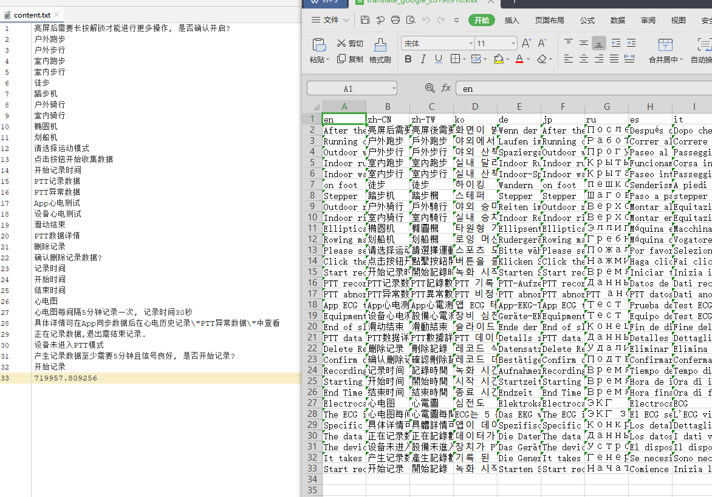

# BatchTranslate

使用Google翻译，批量翻译多国语言

## 第一步

在content.txt中输入要翻译的内容

在最后一行,填写tk参数的值,tk参数的值需要抓包获取

## 第二步

运行GoogleTranslateMult.py即可

## 备注

因使用的是谷歌翻译，所以电脑需要科学上学

若需要修改翻译的国家以及execl的国家排版顺序，请修改Country.py

##示例图片

